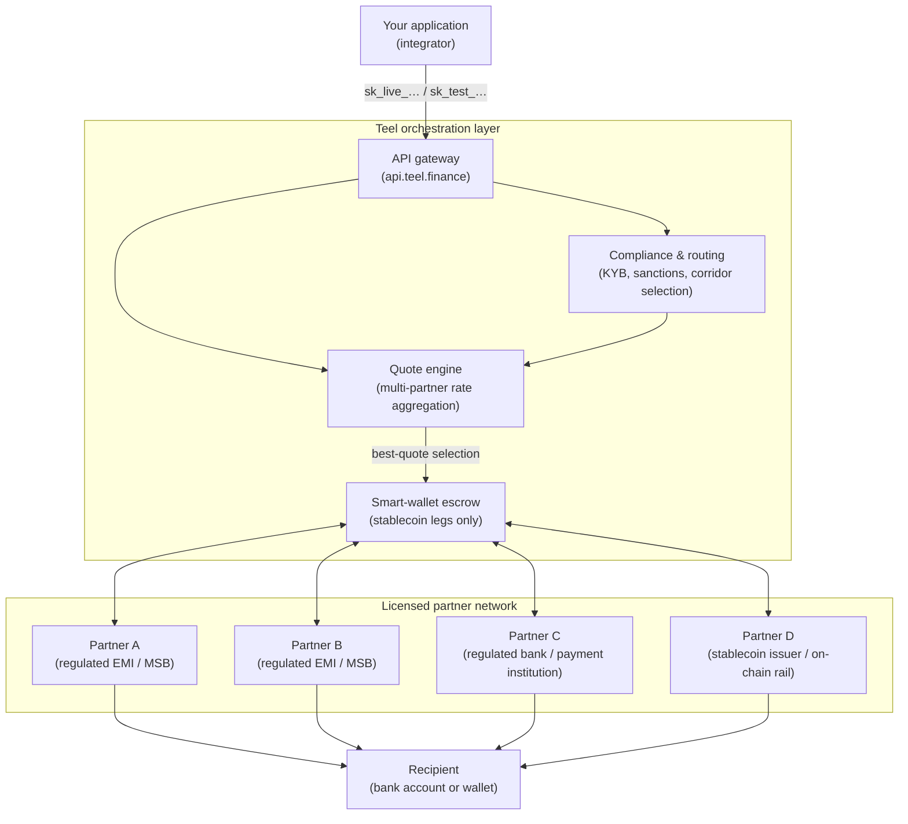
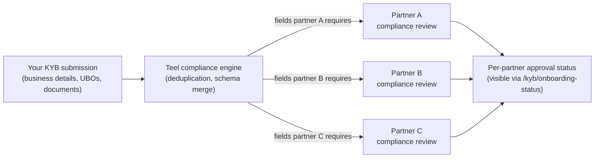

Teel is a **payment orchestration layer**. We aggregate a network of regulated banking and stablecoin partners under a single API, then route each transaction through the partner best suited to the corridor, currency, and rail you've selected.

This page describes the moving parts at a level that's useful for risk, compliance, and engineering reviews — without committing to which partner handles any specific corridor (that's a runtime decision and changes over time as we add new partners).

## High-level architecture



You integrate once with Teel. Underneath, the same payout can route through any of several licensed partners — Teel picks per-transaction based on price, speed, and corridor coverage.

## How funds are orchestrated

Teel does **not** custody fiat. We are not a bank or a money transmitter, and we never hold partner or recipient funds in a Teel-owned bank account. Every leg of every transaction is executed by a licensed third-party institution under their license, with Teel acting as the orchestration and reconciliation layer.

There are three movement patterns the orchestration layer supports:

### Fiat-to-fiat (multi-partner)

The most common partner pattern. Your business sends fiat from your bank account; the recipient receives fiat in theirs.

```mermaid
sequenceDiagram
    autonumber
    participant You as Your app
    participant Teel as Teel API
    participant POn as Onramp partner<br/>(licensed EMI)
    participant Esc as Smart-wallet escrow
    participant POff as Offramp partner<br/>(licensed in destination)
    participant Rec as Recipient bank

    You->>Teel: POST /rfq/execute (quote_id)
    Teel->>POn: Open collection instruction
    POn-->>You: Bank details for inbound transfer
    You->>POn: Send source fiat (e.g. USD)
    POn->>Esc: Mint &amp; deposit stablecoin
    Note over Esc: Funds held on-chain<br/>in audited escrow contract
    Esc->>POff: Release stablecoin to offramp partner
    POff->>Rec: Pay out destination fiat (e.g. PHP)
    POff-->>Teel: Settlement confirmation
    Teel-->>You: payout.delivered webhook
```

Two licensed partners are involved per transaction — one regulated to collect the source fiat, one regulated to disburse the destination fiat. The stablecoin step in the middle exists purely as a settlement primitive between the two regulated legs; it isn't a service you opt into.

### Fiat-to-stablecoin (onramp)

The recipient receives a stablecoin balance on-chain instead of fiat. The first half of the diagram above; the offramp leg is skipped.

### Stablecoin-to-fiat (offramp)

The reverse: you fund the payout with stablecoin from a wallet you control, and the recipient receives fiat. The second half of the diagram; the collection leg is skipped.

## Custody model

Teel's custody surface is minimal by design:

| Asset | Where it sits during a payout | Who controls it |
|---|---|---|
| Source fiat | Licensed collection partner's segregated client account | Collection partner (regulated) |
| Stablecoin (intermediate) | Smart-wallet escrow contract on-chain | Programmatic — released only on partner settlement confirmation |
| Destination fiat | Licensed disbursement partner's settlement account | Disbursement partner (regulated) → recipient |
| Failed / refunded amounts | Returned to source via the same partner that collected | Collection partner |

The smart-wallet escrow is an audited on-chain contract with two-key control (an operator key for routine releases, a cold owner key for emergency intervention). Its sole job is to hold stablecoin between the collection and disbursement legs and to release it deterministically when the disbursement partner confirms readiness. Teel cannot move escrowed funds to a destination not pre-authorized by the corresponding quote and partner instruction.

For onramp-only and offramp-only flows, the escrow step is bypassed entirely.

## Licensing &amp; compliance

Teel operates as a technology service provider to a network of licensed financial institutions. Each leg of every transaction is conducted under the licenses held by the partner executing that leg:

- **Collection legs** are executed by partners licensed as Money Service Businesses, Electronic Money Institutions, or equivalent in the jurisdiction where the source funds originate.
- **Disbursement legs** are executed by partners licensed as banks, EMIs, or remittance providers in the jurisdiction where the destination funds land.
- **On-chain settlement** uses regulated stablecoin issuers (and, where applicable, native cross-chain transfer protocols) for the intermediate leg.

You — our partner — onboard once with Teel through a unified KYB flow. Teel then propagates the relevant subset of your KYB record to each downstream partner whose license is needed to serve the corridors you've requested. This is the same model partners like Ramp Network, Wise Business, and Stripe Treasury use to abstract a network of licensed institutions behind one API.

### Compliance flow



Each partner runs their own independent compliance review under their license. Teel routes transactions only through partners that have approved your KYB for the relevant corridor — corridor availability shows up in [`GET /config/coverage`](/api-reference/config/coverage) once your KYB has cleared.

Per-transaction screening (sanctions, PEP, transaction monitoring) is performed by the executing partner under their license, with Teel forwarding the relevant payload at execution time.

## What Teel is, and isn't

| Teel is | Teel is not |
|---|---|
| A payment orchestration layer | A bank |
| A KYB / compliance aggregator | A money transmitter |
| An on-chain settlement coordinator (stablecoin escrow) | A custodian of partner fiat funds |
| A routing engine selecting the best regulated partner per transaction | A counterparty to your transaction |

If your risk or compliance team asks "who is regulated and where," the answer is **each partner in our network is regulated in the jurisdictions they serve, and the executing partner for any given leg is identified in the payout record's `provider` field**. We can provide the licensing details and audit attestations of the partners covering your corridors on request — contact **support@teel.finance**.

## Next steps

<CardGroup cols={2}>
  <Card title="Coverage" href="/coverage">
    Which corridors, currencies, and rails are routable through the partner network today.
  </Card>
  <Card title="KYB Onboarding" href="/guides/kyb-onboarding">
    How the unified KYB flow propagates your record to the partners covering your corridors.
  </Card>
  <Card title="Webhooks" href="/guides/webhooks">
    Real-time visibility into each leg of a payout as it settles through the partner network.
  </Card>
  <Card title="Errors" href="/errors">
    Status codes, error semantics, and what each terminal state implies for funds movement.
  </Card>
</CardGroup>
