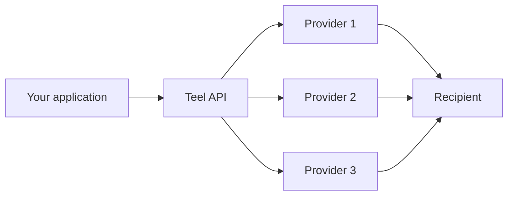
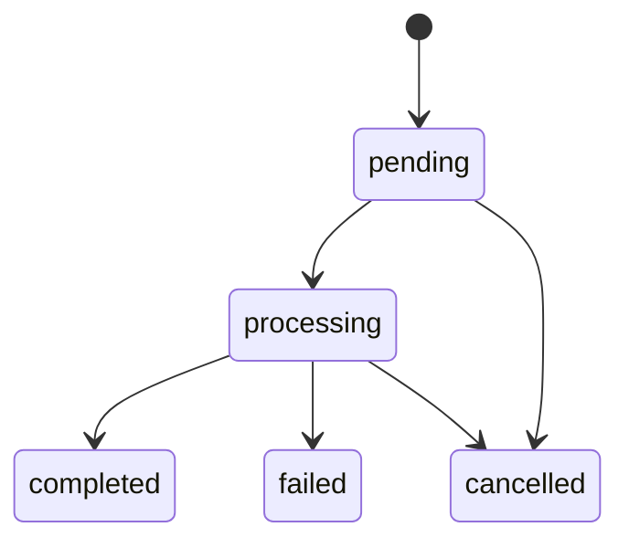
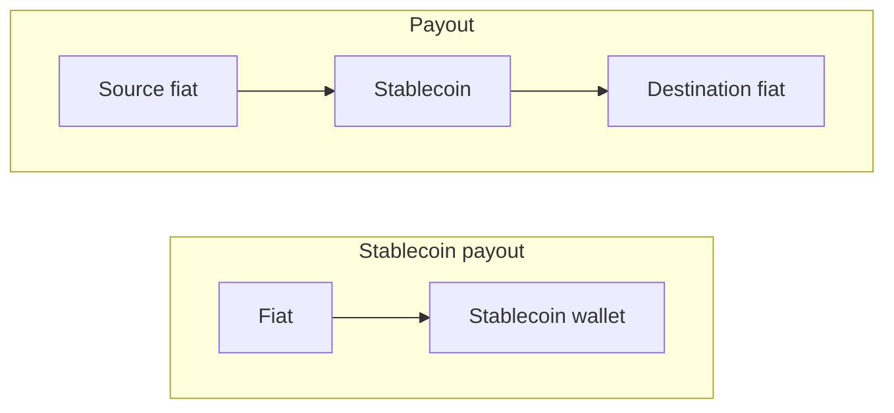

You integrate with Teel once. Behind the API, every payout fans out across a network of providers, lands on the cheapest available route, and reports back over the same status stream — regardless of which provider settled it.

## Multi-provider routing

- **No vendor lock-in** — routes are chosen per-transaction based on rate and corridor coverage.
- **Broader coverage** — the union of every provider's corridors is what your account can reach.
- **Automatic failover** — when one provider degrades, quotes still come back from the rest.

## Lifecycle of a payout

1. **KYB once** — complete business verification in the dashboard before you get API access. Teel propagates it to every provider that licenses your corridors.
2. **Add recipients** — created via the API, provisioned across providers in the background.
3. **Quote** — one request fans out to every provider on the corridor; the best route comes back.
4. **Execute** — Teel pins the chosen route with an opaque token and settles through the winning provider.

## Transaction status

| Status | Meaning |
|---|---|
| `pending` | Created, awaiting provider hand-off. No funds in motion yet. |
| `processing` | Submitted to the winning provider. A Payout may involve both a collection and a disbursement leg. |
| `completed` | Recipient received the funds. Terminal. |
| `failed` | Compliance, balance, or provider error. Inspect `error` on the payout. Terminal. |
| `cancelled` | Quote expired or cancelled before execution. Terminal. |

## How payouts settle

A **Payout** is settled as a collection leg (fiat in) plus a disbursement leg (fiat out), with an on-chain stablecoin hop in between. A **Stablecoin payout** uses the collection leg only — the recipient keeps the stablecoin. The legs can be served by different providers, and Teel picks each independently.

## Real-time updates

Two channels, same events — pick one and you don't need to poll.

- **WebSocket** — push updates as a payout moves through its lifecycle. Authenticate in-band with your API key on the first frame.
- **HTTP webhooks** — POST callbacks to a URL you register. HMAC-signed; verify the signature before processing. See the [Webhooks guide](/guides/webhooks).
