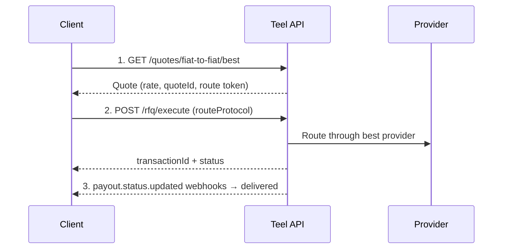

This guide walks through sending a cross-border fiat payment from one currency to another — e.g. USD → MYR. The flow is: quote, execute, track.

## Flow overview



## Prerequisites

- An API key (`sk_live_…` / `sk_test_…`) for an account whose KYB covers the corridor.
- A [recipient](/guides/recipients) with a fiat (bank) payment method in the destination currency. Save its `recipientId`.

## Step 1: Get a quote

Fetch the best available rate for your currency pair. Pass `recipient_id` so the quote accounts for the recipient's payment method:

```bash
curl "https://api.teel.finance/quotes/fiat-to-fiat/best?from_currency=USD&to_currency=MYR&amount=1000&recipient_id=8f3c2a91-4e5b-4d8c-9a1f-3e2b1c4d5e6f" \
  -H "Authorization: Bearer $TEEL_API_KEY"
```

```json
{
  "quoteId": "b1d9…",
  "provider": "provider_a",
  "fromAmount": 1000,
  "toAmount": 4425.00,
  "rate": 4.4250,
  "fee": 5.00,
  "protocol": "rt_9f8a…",
  "expiresAt": "2026-03-10T10:05:00Z"
}
```

Keep the `quoteId` (to poll status) and the opaque `protocol` route token (to pin this route at execution). Execute before `expiresAt`.

## Step 2: Execute the payout

Re-send the corridor and amount, plus the `routeProtocol` token from the quote. Some corridors require a supporting document — pass it as `supportingDocumentKey` when needed (corridor requirements surface in `GET /recipients/requirements`).

```bash
curl -X POST https://api.teel.finance/rfq/execute \
  -H "Authorization: Bearer $TEEL_API_KEY" \
  -H "Content-Type: application/json" \
  -H "Idempotency-Key: $(uuidgen)" \
  -d '{
    "fromCurrency": "USD",
    "toCurrency": "MYR",
    "amount": 1000,
    "recipientId": "8f3c2a91-4e5b-4d8c-9a1f-3e2b1c4d5e6f",
    "routeProtocol": "rt_9f8a…",
    "paymentPurpose": "trade_settlement"
  }'
```

The response includes the `transactionId` and initial status. The payout begins processing immediately — there's no separate "create" then "execute" step.

## Step 3: Track status

Poll the status endpoint with your `quoteId`, or subscribe to webhooks (recommended):

```bash
curl https://api.teel.finance/rfq/status/b1d9… \
  -H "Authorization: Bearer $TEEL_API_KEY"
```

A Payout is settled internally through a collection leg and a disbursement leg, so it moves through several steps: `initiated → compliance_cleared → instructions_sent → collected → converting → settling → delivered` (terminal: `delivered` or `failed`).

For production, subscribe to `payout.status.updated` instead of polling — see the [Webhooks guide](/guides/webhooks).
