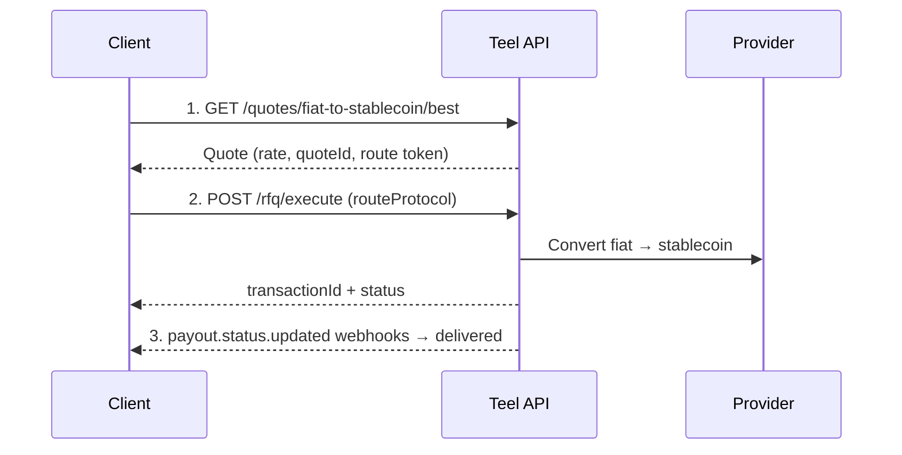

Pay a recipient in stablecoin (e.g. USDC) while funding the payout with fiat. The flow is the same quote → execute → track pattern as a fiat payout — the only difference is the recipient receives stablecoin in a wallet instead of fiat in a bank account.

## Flow overview



## Prerequisites

- An API key whose KYB covers the corridor.
- A [recipient](/guides/recipients) with `transferType: "stablecoin"` and a wallet payment method (token + `rail` for the chain). Save its `recipientId`.

## Step 1: Get a quote

`targetCurrency` is the stablecoin the recipient receives:

```bash
curl "https://api.teel.finance/quotes/fiat-to-stablecoin/best?sourceCurrency=USD&targetCurrency=USDC&amount=1000" \
  -H "Authorization: Bearer $TEEL_API_KEY"
```

```json
{
  "quoteId": "c2e8…",
  "provider": "provider_a",
  "fromAmount": 1000,
  "toAmount": 998.50,
  "rate": 1.0,
  "fee": 1.50,
  "protocol": "rt_4b2c…",
  "expiresAt": "2026-03-11T12:05:00Z"
}
```

## Step 2: Execute

```bash
curl -X POST https://api.teel.finance/rfq/execute \
  -H "Authorization: Bearer $TEEL_API_KEY" \
  -H "Content-Type: application/json" \
  -H "Idempotency-Key: $(uuidgen)" \
  -d '{
    "fromCurrency": "USD",
    "toCurrency": "USDC",
    "amount": 1000,
    "recipientId": "8f3c2a91-4e5b-4d8c-9a1f-3e2b1c4d5e6f",
    "routeProtocol": "rt_4b2c…"
  }'
```

The stablecoin is delivered to the wallet on the recipient's payment method. The response includes the `transactionId` and initial status.

## Step 3: Track status

```bash
curl https://api.teel.finance/rfq/status/c2e8… \
  -H "Authorization: Bearer $TEEL_API_KEY"
```

Subscribe to `payout.status.updated` for production rather than polling — see the [Webhooks guide](/guides/webhooks).

<Note>
Sending a payout funded **with** stablecoin (stablecoin-to-stablecoin, including cross-chain) is configured in the dashboard, not the partner API — see [Crypto payouts](/guides/crypto-payout).
</Note>
