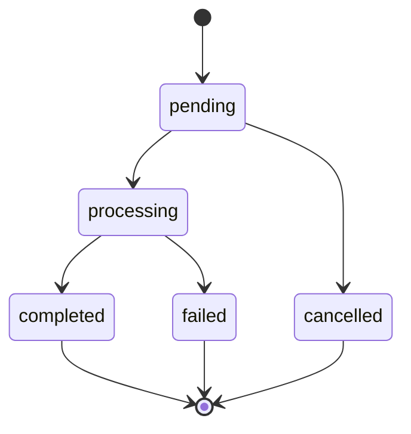

## Overview

Teel sends real-time updates whenever a payout is created or changes status. Two delivery modes:

| Mode | When to use |
| --- | --- |
| **WebSocket** | Your backend can hold a long-lived connection (Node.js server, Go service, Python worker). Lowest latency, no public URL needed. |
| **HTTP webhooks** | Your backend is serverless or runs behind a CDN (Lambda, Cloudflare Workers, Vercel Edge, Next.js API routes). Each event is delivered as a POST to a URL you control. |

You can use either, or both — they carry the same events.

---

## HTTP Webhooks (outbound delivery)

You register one or more URLs, Teel POSTs signed events to them whenever activity occurs on your account.

### Register an endpoint

Add a subscription via the **Webhooks** page in the dashboard. You'll provide:

- **URL** — must be `https://`. Loopback, RFC1918 / private IPv4 and IPv6 ranges, link-local addresses, and known cloud metadata hosts are rejected at create time and at delivery time (DNS is re-resolved before each POST).
- **Events** — pick from the allow list (`payout.created`, `payout.status.updated`).
- **Label** — optional, helps you identify the subscription later (we never send it to your endpoint).

When the subscription is created, Teel shows you a `whsec_…` signing secret **exactly once**. Copy it into your verifier's secret store immediately — there is no way to retrieve it again. Use the **Rotate secret** action in the dashboard if it's ever lost or you suspect it's been exposed; the rotation invalidates the old secret immediately (no overlap window).

### Account limits

| Limit | Value | Why it exists |
| --- | --- | --- |
| Subscriptions per account | **25** | Defensive bound. Each subscription multiplies storage on every delivery; the cap prevents accidental fan-out explosion. |
| Maximum payload size | **256 KB** (JSON-encoded, after envelope wrapping) | Today's payout events are low single-digit KB. Anything larger is dropped. If you ever need bigger payloads, fetch the resource by ID from the REST API instead. |
| Replays per minute per account | **5** | Soft DoS-via-self guard on `POST /api/webhooks/deliveries/{id}/replay`. Burst of 5; refills at 5/min. 429 responses include `Retry-After`. |

### Delivery format

Teel POSTs the JSON envelope to your URL with three headers:

```http
POST /your-receiver HTTP/1.1
Content-Type: application/json
Teel-Signature: t=1700000000,v1=aa18d1cf05da9fefeda2e186a6e3eb297ff3ecfc85c88b18e334e03aed442487
Teel-Delivery-Id: 54697e99-c2f5-4630-9f88-c1a3b1428d65
Teel-Event-Type: payout.status.updated

{"type":"payout.status.updated","created_at":"2026-05-27T09:30:46Z","data":{...}}
```

| Header | Meaning |
| --- | --- |
| `Teel-Signature` | HMAC-SHA256 over `t.body` with your signing secret. `t=` is the Unix timestamp (seconds), `v1=` is the hex digest. See [verifying](#verifying-signatures). |
| `Teel-Delivery-Id` | Unique ID for **this delivery attempt's row** in Teel's queue. Use it to dedupe — retries re-send with the same `Teel-Delivery-Id`, replays use a fresh one. |
| `Teel-Event-Type` | The event type, mirrors `data.type` in the body. |

### Successful response

Any **2xx** response within 10 seconds counts as success. We don't read the body — return whatever shape you like, including an empty 200. Slow responses are aborted at 10s and treated as a transport failure.

### Retry behavior

A non-2xx response, a connection error, or a timeout triggers a retry. The schedule is exponential:

| Attempt | Delay after the previous one |
| --- | --- |
| 1 | (initial) |
| 2 | ~30 seconds |
| 3 | ~2 minutes |
| 4 | ~8 minutes |
| 5 | ~32 minutes |
| 6 (won't happen) | — |

After 5 attempts the delivery is marked `permanently_failed`. It stays visible in the dashboard's **Delivery history** indefinitely (until pruned, no sooner than 30 days). Use **Replay** to re-enqueue a fresh attempt at any time.

<Note>
  Webhook delivery is **at-least-once**. The same `Teel-Delivery-Id` may arrive more than once if a 2xx response was lost on the wire. Idempotency on your end (e.g. an `INSERT … ON CONFLICT (delivery_id) DO NOTHING`) is the safest pattern.
</Note>

### Verifying signatures

Every delivery is HMAC-SHA256-signed over `t=<unix>.<raw body>` using your subscription's `whsec_…` secret. Recompute the digest on your side and constant-time-compare. Reject anything older than 5 minutes — that's the replay-protection window.

<CodeGroup>

```javascript Node.js (Express)
import crypto from "crypto";
import express from "express";

const WEBHOOK_SECRET = process.env.TEEL_WEBHOOK_SECRET; // whsec_...
const TOLERANCE_SECONDS = 5 * 60;

const app = express();

// IMPORTANT: use express.raw — we need the EXACT bytes Teel signed.
app.post(
  "/teel-webhook",
  express.raw({ type: "application/json" }),
  (req, res) => {
    const header = req.get("Teel-Signature");
    if (!header) return res.status(400).send("missing signature");

    // Parse `t=<unix>,v1=<hex>` (additional v2/v3 schemes may be added later).
    const parts = Object.fromEntries(
      header.split(",").map((p) => p.split("=", 2))
    );
    const ts = Number.parseInt(parts.t, 10);
    if (!Number.isFinite(ts)) return res.status(400).send("bad timestamp");

    if (Math.abs(Date.now() / 1000 - ts) > TOLERANCE_SECONDS) {
      return res.status(400).send("stale or future timestamp");
    }

    const expected = crypto
      .createHmac("sha256", WEBHOOK_SECRET)
      .update(`${ts}.`)
      .update(req.body) // raw Buffer
      .digest("hex");

    const got = Buffer.from(parts.v1 ?? "", "hex");
    const exp = Buffer.from(expected, "hex");
    if (got.length !== exp.length || !crypto.timingSafeEqual(got, exp)) {
      return res.status(400).send("invalid signature");
    }

    // Signature verified — safe to parse + handle.
    const event = JSON.parse(req.body.toString("utf8"));
    const deliveryId = req.get("Teel-Delivery-Id");

    // Dedupe on Teel-Delivery-Id at your storage layer here.
    console.log(`[${event.type}]`, event.data, `delivery=${deliveryId}`);

    res.status(200).end();
  }
);

app.listen(3000);
```

```python Python (Flask)
import hmac
import hashlib
import os
import time
from flask import Flask, request, abort

WEBHOOK_SECRET = os.environ["TEEL_WEBHOOK_SECRET"]  # whsec_...
TOLERANCE_SECONDS = 5 * 60

app = Flask(__name__)


@app.post("/teel-webhook")
def teel_webhook():
    header = request.headers.get("Teel-Signature", "")
    parts = dict(p.split("=", 1) for p in header.split(",") if "=" in p)
    try:
        ts = int(parts["t"])
    except (KeyError, ValueError):
        abort(400, "bad timestamp")

    if abs(time.time() - ts) > TOLERANCE_SECONDS:
        abort(400, "stale or future timestamp")

    # IMPORTANT: request.get_data() returns the EXACT bytes Teel signed.
    body = request.get_data()
    expected = hmac.new(
        WEBHOOK_SECRET.encode("utf-8"),
        f"{ts}.".encode("utf-8") + body,
        hashlib.sha256,
    ).hexdigest()

    if not hmac.compare_digest(expected, parts.get("v1", "")):
        abort(400, "invalid signature")

    # Signature verified — safe to parse + handle.
    event = request.get_json(force=True)
    delivery_id = request.headers.get("Teel-Delivery-Id")

    # Dedupe on Teel-Delivery-Id at your storage layer here.
    print(f"[{event['type']}] {event['data']} delivery={delivery_id}")

    return "", 200
```

</CodeGroup>

<Warning>
  Frameworks that auto-parse JSON (e.g. Express's default `express.json()`, FastAPI body parsing) **rewrite the body before your handler runs** — the bytes you'd then re-serialize won't match what we signed. Always read the raw body for signature verification, then parse. The samples above use `express.raw()` and `request.get_data()` for exactly this reason.
</Warning>

### Event types

#### `payout.created`

Fires once when a payout is first created (any flow — fiat-to-fiat, stablecoin-to-fiat, batch row).

```json
{
  "type": "payout.created",
  "created_at": "2026-05-27T09:30:46Z",
  "data": {
    "payout_id": "txn_def456",
    "transaction_type": "fiat_to_fiat",
    "payout_amount": 10000.0,
    "payout_currency": "EUR",
    "source_currency": "USD",
    "recipient_id": "rec_abc123",
    "status": "pending",
    "created_at": "2026-05-27T09:30:46Z"
  }
}
```

#### `payout.status.updated`

Fires every time a payout's status or step changes. Multiple events are emitted per payout as it progresses (`pending` → `processing` → `completed` is at least three updates, plus per-step transitions like `compliance_cleared`, `instructions_sent`, `collected`, `converting`, `settling`, `delivered`).

```json
{
  "type": "payout.status.updated",
  "created_at": "2026-05-27T09:31:02Z",
  "data": {
    "payout_id": "txn_def456",
    "status": "processing",
    "provider": "provider_b",
    "step": "settling",
    "step_changed_at": "2026-05-27T09:31:02Z"
  }
}
```

---

## WebSocket Connection

If you can hold an open connection, the WebSocket delivers the same events with sub-100ms latency. Authenticate in-band with your Auth0 access token:

```javascript
const ws = new WebSocket("wss://api.teel.finance/ws");

ws.onopen = () => {
  // Send auth as the first message — we close the socket if we don't see it
  // within 10 seconds.
  ws.send(JSON.stringify({ type: "auth", token: "YOUR_AUTH0_ACCESS_TOKEN" }));
};

ws.onmessage = (event) => {
  const data = JSON.parse(event.data);
  if (data.type === "payout.status.updated") {
    // ...same shape as the HTTP webhook payload's `data` field
  }
};
```

The WebSocket scopes events to your account — you only see events for payouts your business owns.

---

## Status Transitions

All payouts follow the same status state machine regardless of the underlying provider:



| Status | Description |
| --- | --- |
| `pending` | Payout created but not yet submitted to the provider |
| `processing` | Provider has accepted the payout and is executing it |
| `completed` | Funds have been delivered to the recipient |
| `failed` | The payout failed during processing |
| `cancelled` | The payout was cancelled before processing began |

### Step transitions

Within `processing`, the payout progresses through a fixed sequence of steps. The `step` field on `payout.status.updated` reflects the current position:

`initiated` → `compliance_cleared` → `instructions_sent` → `collected` → `converting` → `settling` → `delivered`

Steps are monotonic — they only ever move forward.

---

## End-to-end example

A fiat-to-fiat payout from your dashboard generates roughly this sequence of events (some steps fire multiple times depending on the providers involved):

```
payout.created           { status: pending,    step: initiated }
payout.status.updated    { status: processing, step: compliance_cleared }
payout.status.updated    { status: processing, step: instructions_sent }
payout.status.updated    { status: processing, step: collected }
payout.status.updated    { status: processing, step: converting }
payout.status.updated    { status: processing, step: settling }
payout.status.updated    { status: completed,  step: delivered }
```

Your verifier dedupes on `Teel-Delivery-Id` so transient retries (e.g. one of these events 2xx-acknowledged but the response was lost on the wire) don't double-process.
